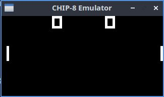
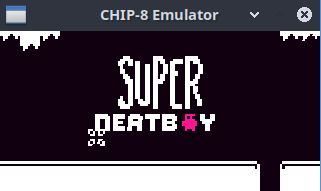

# Chip8

A CHIP-8 emulator written in pure C using SDL2, with support for SCHIP and XO-CHIP extensions

## Building and Running

Configure and build the project:

```bash
mkdir build && cd build && cmake .. && make
```

## Execution

Run the emulator by passing the path to a CHIP-8, SCHIP, or XO-CHIP ROM as an argument:

```bash
./chip8 path/to/rom.ch8 [-chip8 | -schip | -xochip] -[scale 5-20]
```





## License

MIT
