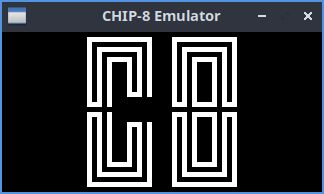
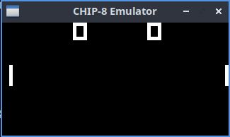
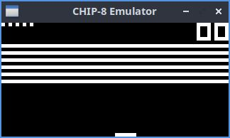
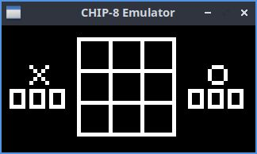

# Mychip8 Emulator

A CHIP-8 interpreter written in pure C, using SDL2 for graphics rendering. 

This project was built from scratch following the technical specifications of [Cowgod's CHIP-8 Technical Reference](http://devernay.free.fr/hacks/chip8/C8TECH10.HTM).

## Building and Running

Build the project using the provided `Makefile`:

```bash
make
```

## Execution

Run the emulator by passing the path to a CHIP-8 ROM as an argument:

```bash
./mychip8 /path/to/rom.ch8
```






## License

MIT
